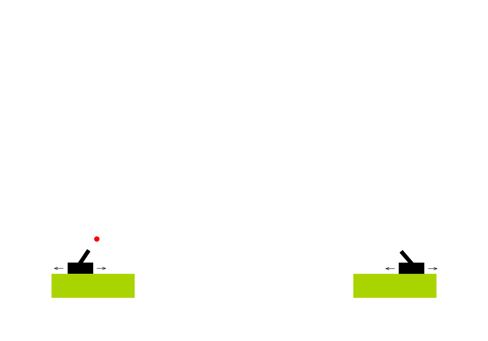

# Inteligencia artificial

## Examen parcial

Enunciado:

Se pide implementar una mecánica similar al juego [Gunbound](https://www.youtube.com/watch?v=9ZBm9MOasHM) (ver figura al final del documento).

- El juego es de 800x560 píxeles.

- Los tanques tienen un desplazamien limitado de izquierda a derecha, cada uno en su respectiva plataforma (no físicas, usar lerp).

- El juego se desarrollará por turnos. En cada turno, el jugador respectivo puede:

  - Desplazarse de izquierda a derecha utilizando las flechas direccionales.
  - Apuntar con el puntero del mouse hacia dónde se debe disparar.
  - Disparar utilizando la barra espaciadora.

- La bala sale disparada realizando un movimiento parabólico hasta que:

  - Colisionar con el tanque del jugador oponente. 
  - Salga de la pantalla.

  Una vez terminada la jugada, se pasa la posta al jugador oponente.

- Cuando termina el juego, se debe mostrar si ganó el jugador 1 o el jugador 2.

**Nota:**

- Ambos jugadores usan las mismas teclas.
- Se calificará el correcto uso de lerp, máquinas de estados y físicas.

Suerte!

